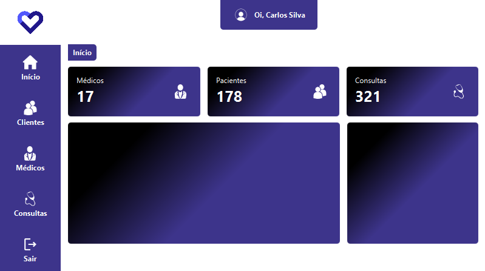
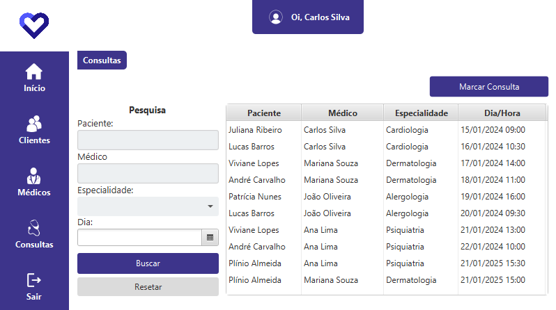
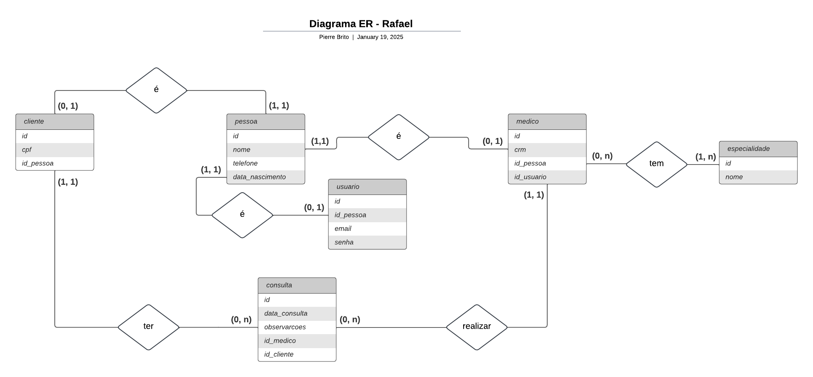

# Sistema de Gerenciamento de Consultas Médicas

Este projeto implementa um sistema CRUD (Create, Read, Update, Delete) para gerenciar pacientes, médicos e consultas em um ambiente clínico.

## Visão Geral

O objetivo deste sistema é facilitar o gerenciamento de informações relacionadas a pacientes, médicos e suas respectivas consultas. Ele permite:

- **Criação** de novos registros de pacientes, médicos e consultas.
- **Leitura** das informações existentes.
- **Atualização** de dados quando necessário.
- **Exclusão** de registros que não são mais necessários.

## Funcionalidades

- **Gerenciamento de Pacientes**: Adicionar, visualizar, atualizar e remover informações de pacientes.
- **Gerenciamento de Médicos**: Controle sobre os dados dos médicos.
- **Agendamento de Consultas**: Sistema para agendar, modificar ou cancelar consultas.

- **Interface de login**:
  
  
- **Interface de dashboard**:
  
  
- **Interface de consultas**:
  

## Diagrama ER

## Dicionário de Dados

### Tabela: `pessoa`
| Nome do Atributo | Tipo de Dado | Tamanho | Descrição | Restrições |
|-------------------|--------------|---------|------------|-------------|
| id                | SERIAL       |         | Identificador único da pessoa | Chave Primária |
| nome              | VARCHAR      | 100     | Nome completo da pessoa | NOT NULL |
| telefone          | VARCHAR      | 15      | Número de telefone da pessoa |  |
| data_nascimento   | DATE         |         | Data de nascimento da pessoa |  |

### Tabela: `usuario`
| Nome do Atributo | Tipo de Dado | Tamanho | Descrição | Restrições |
|-------------------|--------------|---------|------------|-------------|
| id                | SERIAL       |         | Identificador único do usuário | Chave Primária |
| id_pessoa         | INT          |         | Chave estrangeira para a tabela pessoa | NOT NULL, FK para `pessoa(id)` |
| email             | VARCHAR      | 100     | Endereço de email do usuário | UNIQUE, NOT NULL |
| senha             | VARCHAR      | 50      | Senha do usuário (hash recomendado) | NOT NULL |

### Tabela: `especialidade`
| Nome do Atributo | Tipo de Dado | Tamanho | Descrição | Restrições |
|-------------------|--------------|---------|------------|-------------|
| id                | SERIAL       |         | Identificador único da especialidade | Chave Primária |
| nome              | VARCHAR      | 100     | Nome da especialidade médica | UNIQUE, NOT NULL |

### Tabela: `medico`
| Nome do Atributo | Tipo de Dado | Tamanho | Descrição | Restrições |
|-------------------|--------------|---------|------------|-------------|
| id                | SERIAL       |         | Identificador único do médico | Chave Primária |
| id_pessoa         | INT          |         | Chave estrangeira para a tabela pessoa | NOT NULL, FK para `pessoa(id)` |
| id_usuario        | INT          |         | Chave estrangeira para a tabela usuário | NOT NULL, FK para `usuario(id)` |
| crm               | VARCHAR      | 20      | Registro de médico (CRM) | UNIQUE, NOT NULL |

### Tabela: `medico_especialidade`
| Nome do Atributo  | Tipo de Dado | Tamanho | Descrição | Restrições |
|-------------------|--------------|---------|------------|-------------|
| id_medico         | INT          |         | Chave estrangeira para a tabela médico | NOT NULL, FK para `medico(id)`, Parte da PK |
| id_especialidade  | INT          |         | Chave estrangeira para a tabela especialidade | NOT NULL, FK para `especialidade(id)`, Parte da PK |

### Tabela: `cliente`
| Nome do Atributo | Tipo de Dado | Tamanho | Descrição | Restrições |
|-------------------|--------------|---------|------------|-------------|
| id                | SERIAL       |         | Identificador único do cliente | Chave Primária |
| id_pessoa         | INT          |         | Chave estrangeira para a tabela pessoa | NOT NULL, FK para `pessoa(id)` |
| cpf               | VARCHAR      | 14      | Cadastro de Pessoas Físicas (CPF) do cliente | UNIQUE, NOT NULL |

### Tabela: `consulta`
| Nome do Atributo | Tipo de Dado | Tamanho | Descrição | Restrições |
|-------------------|--------------|---------|------------|-------------|
| id                | SERIAL       |         | Identificador único da consulta | Chave Primária |
| id_medico         | INT          |         | Chave estrangeira para a tabela médico | NOT NULL, FK para `medico(id)` |
| id_cliente        | INT          |         | Chave estrangeira para a tabela cliente | NOT NULL, FK para `cliente(id)` |
| data_consulta     | TIMESTAMP    |         | Data e hora da consulta | NOT NULL |
| observacoes       | TEXT         |         | Observações ou notas da consulta |  |

## Tecnologias:
- Java 21
- JavaFX
- Banco PostgreSQL
- JDBC
- Eclipse IDE

